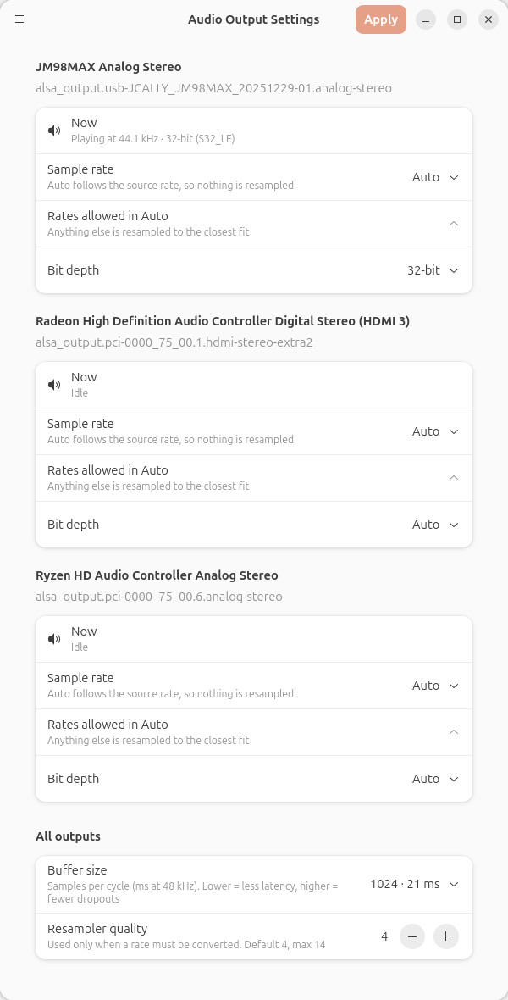

<div align="center">


# Audio Output Settings

**Pick the sample rate and bit depth for each audio output on Linux, with no config files to edit.**

A small native GNOME app for PipeWire. Set your USB DAC to follow the source rate, fix your HDMI output at 48 kHz, and choose the bit depth, all from one window.


<picture>
  <source media="(prefers-color-scheme: dark)" srcset="screenshots/dark.png">
  
</picture>

</div>

---

## 🤔 Why?

Windows and macOS let you pick an output's sample rate from a drop-down. Ubuntu (GNOME) has no such setting.

By default, PipeWire runs every output at a fixed **48 kHz** and resamples anything else to it. A 44.1 kHz song from Spotify or a CD rip is converted before it reaches your DAC. To change that, you would normally have to write PipeWire and WirePlumber config files by hand.

This app writes those files for you.

## ✨ Features

| | |
|---|---|
| 🎚️ **Per-output sample rate** | **Auto** switches the hardware to the rate of whatever is playing (44.1 → 44.1, 96 → 96), so nothing is resampled. You can also lock an output to a fixed rate. |
| ✅ **Allowed rates** | Choose which rates Auto may switch to. Anything else is resampled to the closest fit. |
| 🔢 **Bit depth** | Auto, 16-bit, 24-bit or 32-bit. Only the formats your hardware really supports are listed. |
| 📡 **Live status** | See what the hardware is actually running at right now, read straight from the kernel (`hw_params`). |
| ⏱️ **Buffer size** | Trade latency against dropouts (128 to 4096 samples). |
| 🎛️ **Resampler quality** | Raise the quality used when conversion is unavoidable (0–14). |
| 💾 **Persistent** | Settings are saved as standard config files and survive reboots. The app does not need to stay open. |
| ♻️ **Factory reset** | A **Reset** button at the bottom of the window removes everything the app wrote and restores PipeWire's defaults, after asking for confirmation. |

## 📦 Requirements

- A Linux desktop running **PipeWire** with **WirePlumber 0.5+** (Ubuntu 24.04 and later, Fedora 40+, …)
- **Python 3** with **GTK4** and **libadwaita** bindings. These are preinstalled on Ubuntu GNOME. Elsewhere:

  ```bash
  # Debian / Ubuntu
  sudo apt install python3-gi gir1.2-gtk-4.0 gir1.2-adw-1
  # Fedora
  sudo dnf install python3-gobject gtk4 libadwaita
  ```

## 🚀 Install

```bash
git clone https://github.com/JotaMarti/audio-output-settings.git
cd audio-output-settings
./install.sh
```

Then open **Audio Output Settings** from your app menu. You can also run it directly with `python3 pw_output_settings.py`.

To uninstall, click **Reset** under **Reset → Factory settings** at the bottom of the window, then delete the launcher:

```bash
rm ~/.local/share/applications/audio-output-settings.desktop
```

## 🎧 Usage

1. Each output (USB DAC, HDMI, headphone jack…) has its own card.
2. Set **Sample rate**:
   - **Auto** (recommended): the output follows the source rate.
   - **A fixed rate**: the output always runs at that rate.
3. Set **Bit depth**. **32-bit** is usually best, because PipeWire processes audio internally as 32-bit float and 16- or 24-bit sources fit into 32-bit without any loss.
4. Click **Apply**. PipeWire restarts, so audio drops out for about a second and some players (such as Spotify) need you to press play again.
5. Check the **Now** row while music is playing to confirm the change.
6. Want to undo everything? Click **Reset** at the bottom of the window to go back to factory settings.

## ⚙️ How it works

The app never touches the audio itself. It only generates standard PipeWire/WirePlumber configuration:

| File | Purpose |
|---|---|
| `~/.config/wireplumber/wireplumber.conf.d/60-pw-output-settings.conf` | Per-output rules: `audio.format`, `audio.rate`, `audio.allowed-rates` |
| `~/.config/pipewire/pipewire.conf.d/60-pw-output-settings.conf` | Graph clock: `default.clock.allowed-rates`, `default.clock.quantum` |
| `~/.config/pipewire/client.conf.d/60-pw-output-settings.conf` | `resample.quality` for native PipeWire apps |
| `~/.config/pipewire/pipewire-pulse.conf.d/60-pw-output-settings.conf` | `resample.quality` for PulseAudio apps |
| `~/.config/pw-output-settings/settings.json` | The app's own saved choices |

Each output's supported rates and formats come from the hardware itself: `/proc/asound/cardN/stream0` for USB devices and the HDA codec info for onboard and HDMI audio. As a result, the list does not shrink after you force a format.

## 💡 Tips & FAQ

<details>
<summary><b>Auto is selected, but the rate doesn't change</b></summary>

PipeWire only switches rates while the output is idle. If any app keeps the output open, the rate stays where it is. A common culprit is the GNOME **Settings → Sound** panel, whose level meter holds the device open. Close it, stop playback for a few seconds, then play again.
</details>

<details>
<summary><b>Why do HDMI and onboard audio only offer 16-bit and 32-bit?</b></summary>

HD-Audio chips carry 20- and 24-bit samples inside a 32-bit container, so "32-bit" is the right choice for 24-bit content there. USB DACs often expose a packed 24-bit format as well.
</details>

<details>
<summary><b>Should I lock my DAC to 96 or 192 kHz?</b></summary>

Usually not. Upsampling a 44.1 kHz source does not add any information. **Auto** delivers each track at its native rate, which is the cleanest path.
</details>

<details>
<summary><b>My DAC disconnects or stops being detected</b></summary>

First click **Reset** to go back to factory settings. If the device still drops out, the app is not the cause. Check `journalctl -k` for `USB disconnect` or `error -71` messages: those point to a bad cable, connector or USB port. Try a different port, ideally one on another USB controller.
</details>

<details>
<summary><b>Ubuntu showed a "wireplumber crashed" report after applying</b></summary>

WirePlumber 0.5 can abort in its own shutdown code when it is restarted. It is harmless, because the service comes straight back. The app now stops WirePlumber in a way that avoids that code path. To dismiss an old report, delete `/var/crash/_usr_bin_wireplumber.*.crash`.
</details>

## 📄 License

[MIT](LICENSE) © JotaMarti
